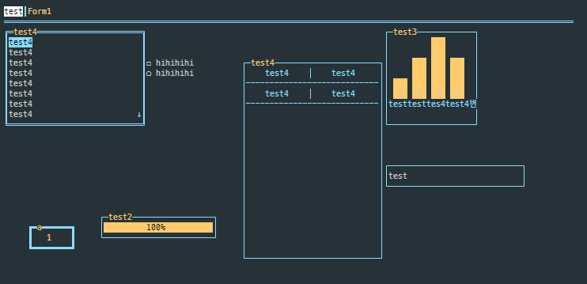

# CCurses



ccurses is a library made of ncurses library. The basic base was implemented by designing a window form.

## Feature

* Easy
* Keyboard, mouse event
* Theme
* Wide Character

## Pre-preparements

#### Centos

```bash
yum install ncurses-devel
```

#### Ubuntu

```bash
sudo apt-get install libncurses5-dev libncursesw5-dev
```

>If you want Korean language, install a language pack.
>
>```bash
>apt-get install language-pack-ko
>```
>
>```bash
>LANG=ko_KR.UTF-8
>```

## Use Curses!

#### build

```bash
make
```

#### test

```bash
$> ./bin/Test
```

## Widget

* TextBox
* Button
* Input
* Tab
* List
* ProgressBar
* Table
* BarChart
* CheckBox
* Radio(TODO)
